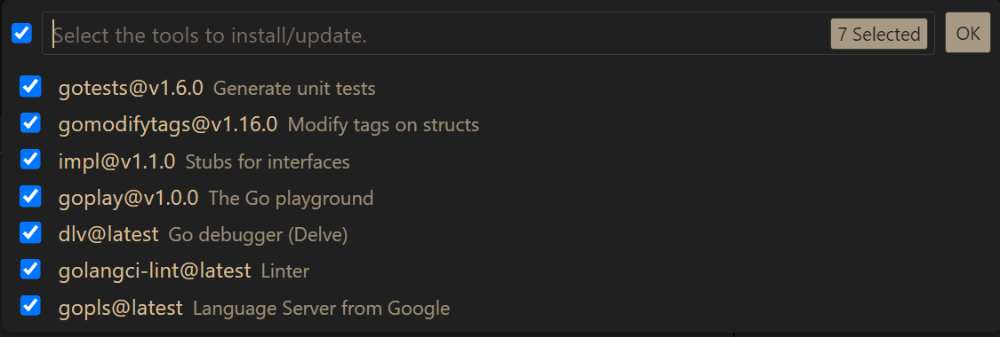
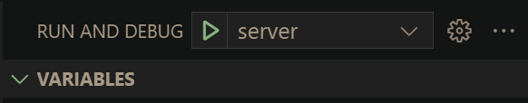

# Orange Backstage API

## Development

### Prerequisites

- Install [Golang 1.21+](https://golang.org/dl/)
- Install [Visual Studio Code (VSCode)](https://code.visualstudio.com/)

### Setup

1. Clone the project to your local machine.

2. Open the project in VSCode. If you install `code` command, you can run the following command to open the project in VSCode.

    ```bash
    code /path/to/orange-backstage-api
    ```

3. Install [Go extension](https://marketplace.visualstudio.com/items?itemName=golang.go) in VSCode.

4. Install [Go tools] in VSCode. Press `Ctrl+Shift+P` to open command palette, then type `Go: Install/Update Tools` and press `Enter`. Select all tools and click `OK`.

    

5. Create `debug` folder in the root of the project.

    ```bash
    mkdir debug
    ```

6. Create `server_config.yaml` in `debug` folder. Copy the following content to `server_config.yaml`.

    ```yaml
    server:
      run_mode: debug
      port: 8080
      read_timeout: 30s
      wrtie_timeout: 30s
      cert_file_path:
      key_file_path:
      jwt:
        secret: "this is a secret"
        access_token_expire: 30s
        refresh_token_expire: 60s
    log:
      level: debug
      file_name: ./app.log
      max_size: 10
      max_age: 7
      max_backups: 10
      compress: true
      console_debug: true
    ```

    > Note1: The `jwt.secret` is used to sign the JWT token. You can use any string as the secret.
    >
    > Note2: The `jwt.access_token_expire` and `jwt.refresh_token_expire` are used to set the expire time of the JWT token. You can set the expire time to any value you want.

7. Press `F5` to start debugging. Or you can press `Ctrl+Shift+D` to open the debug panel, then click `Run` button with the config called `server`.

    

8. Use `cURL` to test the API.

    ```bash
    $ curl -X GET http://localhost:8080/api/v1/health

    # {"code":101000,"data":{"health":"ok","time":"2023-09-24T18:25:12.598820633+08:00"}}
    ```

### Swagger

1. Start the server in debug mode.
2. Open the following URL in browser. The port number is the same as the one in `server_config.yaml`.

    ```url
    http://localhost:{port}/swagger/index.html
    ```
