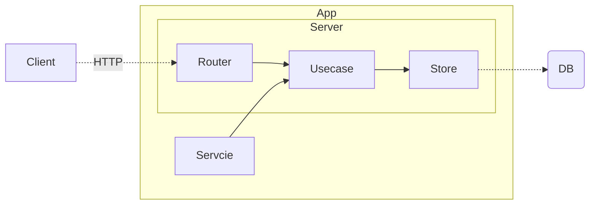

# App Architecture Design

|Metadata|Value|
|--------|-----|
|Date    |2023-09-24|
|Author  |@shadow3x3x3|
|Status  |Proposed|
|Tags    |api,server|

## Context

- Server: HTTP server
- Router: Handle request and response
- Usecase: Handle business logic
- Store: Handle data access
- Service: Handle external service access, like scheduler
